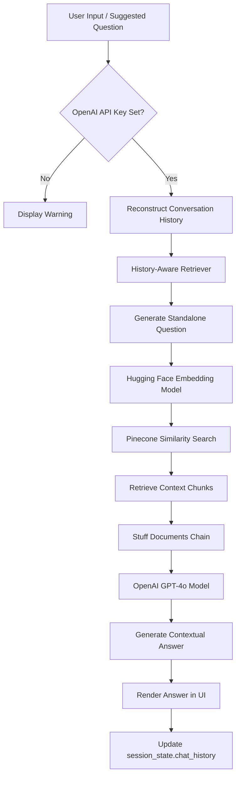

# Dr. Query — Conversational Medical RAG Assistant

Dr. Query is a production-grade, conversational Retrieval-Augmented Generation (RAG) assistant designed to answer medical questions using curated clinical guidelines. The application features a clean, dark-themed responsive dashboard built on **Streamlit**, optimized for free, permanent hosting on **Streamlit Community Cloud**.

It enforces a strict privacy-first model, requiring users to input their own OpenAI API key which is processed in volatile memory only.

---

## Key Features

- **Conversational RAG Pipeline**: Remembers chat context and reformulates follow-up queries using LangChain's `create_history_aware_retriever`.
- **Zero-Storage Privacy**: End-user OpenAI API keys are held transiently in browser memory, never saved, written to disk, or logged.
- **SaaS-inspired Dashboard**: Tailored dark navy and cyan accent interface containing card-styled suggested questions and a sidebar configuration panel.
- **Serverless Scaling**: Built on a high-performance database setup using Pinecone and Hugging Face Embeddings.

---

## Technical Architecture & RAG Pipeline



1. **Standalone Question Reformulation**: When a user asks a follow-up question, the app passes the conversation history and query to `create_history_aware_retriever` to produce a standalone search query.
2. **Dense Vector Retrieval**: The standalone query is embedded using `sentence-transformers/all-MiniLM-L6-v2` (384-dimensional dense vectors) and compared using cosine metric against the `medical-chatbot` index in Pinecone.
3. **Synthesis & Generation**: The top 3 matching chunks are fetched and bundled into the system prompt. OpenAI's `gpt-4o` synthesizes the response, which is immediately rendered in the UI.

---

## Technology Stack

- **Frontend Interface**: Streamlit (with custom CSS/HTML injections)
- **Framework Orchestration**: LangChain (`langchain-openai`, `langchain-pinecone`, `langchain-community`)
- **Embeddings Model**: Hugging Face Hub (`sentence-transformers/all-MiniLM-L6-v2` returning 384 dimensions)
- **Vector Database**: Pinecone Serverless
- **Inference LLM**: OpenAI `gpt-4o`

---

## Project Structure

```
├── app.py                # Main Streamlit application & UI entrypoint
├── requirements.txt      # Python package dependencies
├── setup.py              # Local package installer setup
├── store_index.py        # Database indexing script (for parsing source PDF data)
├── template.sh           # Directory setup script
├── src/
│   ├── __init__.py
│   ├── helper.py         # PDF loaders and Hugging Face embedding loader helper
│   └── prompt.py         # System prompts for conversational RAG
└── data/
    └── (Source PDF medical manuals)
```

---

## Local Setup & Development

### 1. Prerequisites
- Python 3.10+
- A Pinecone account and API key with an existing index named `medical-chatbot` loaded with 384-dimension embeddings.

### 2. Installation
Clone the repository:
```bash
git clone <repository-url>
cd medical-chatbot
```

Create and activate a virtual environment:
```bash
python -m venv venv
# On Windows:
venv\Scripts\activate
# On Linux/macOS:
source venv/bin/activate
```

Install the dependencies:
```bash
pip install -r requirements.txt
```

### 3. Environment Variables (Local)
Create a `.env` file in the root directory to store your Pinecone credentials. **Do not include your OpenAI API key here**, as the application is designed to ingest the user's key dynamically through the UI:

```env
PINECONE_API_KEY="your-pinecone-api-key-here"
```

### 4. Running the Application Locally
Run the Streamlit server:
```bash
streamlit run app.py
```
The application will spin up locally and load in your browser at `http://localhost:8501`.

---

## Streamlit Community Cloud Deployment

Dr. Query is optimized for instant deployment to the **Streamlit Community Cloud** platform.

### Step-by-Step Deployment

1. Push your repository to your GitHub account.
2. Sign in to the [Streamlit Community Cloud Dashboard](https://share.streamlit.io/).
3. Click **New App**, select your repository, set the branch to `main`, and enter **`app.py`** as the **Main file path**.
4. Open the **Advanced settings** drawer, navigate to **Secrets**, and enter your Pinecone configuration:
   ```toml
   PINECONE_API_KEY = "your-pinecone-api-key-here"
   ```
5. Click **Deploy**. Your professional medical assistant will be live at a public URL!

---

## Security Policy

To prevent API cost exposure, Dr. Query decouples LLM generation from static server-side environment variables:
- **No Disk Writes**: Keys entered in the sidebar are held strictly in memory for the duration of the current browser session.
- **Volatile Execution**: The OpenAI client is instantiated dynamically per query and immediately discarded.
- **Zero Log Prints**: No user keys or metadata are printed to the console or system logs.
